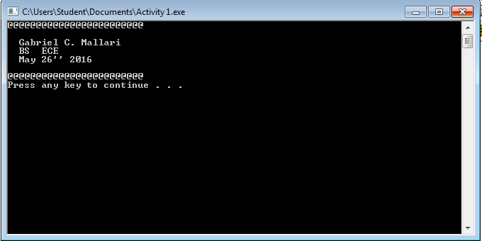
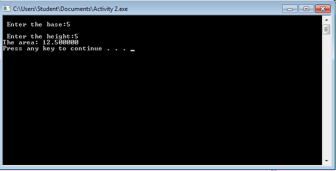
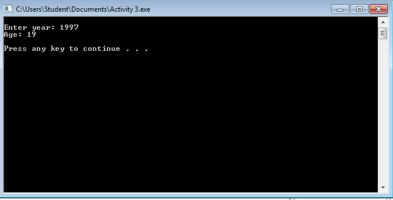
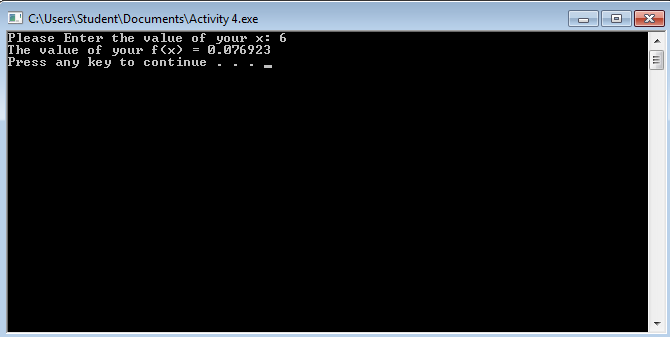

# Activity1-MallariG


Activity1
```
#include <stdio.h>
#include <stdlib.h>

int main(){

printf("@@@@@@@@@@@@@@@@@@@@@@@@\n");
printf(" \n  Gabriel C. Mallari \n");
printf("  BS  ECE\n");
printf("  May 26'' 2016\n");
printf("\n@@@@@@@@@@@@@@@@@@@@@@@@\n");


system("PAUSE");
}

```


```
#include <stdio.h>
#include <stdlib.h>

int main(){
 int base, height; 
 float area;


printf("\n Enter the base:" );
scanf("%d", &base);
printf("\n Enter the height:" );
scanf("%d", &height);
area= 0.5 *(base*height);
printf("The area: %f\n", area);
system("PAUSE");
return 0;


system("PAUSE");


}
```


```
#include <stdio.h>
#include <stdlib.h>

int main(){
 int year, age;
 printf("\nEnter year: ");
 scanf("%d", &year);
age = 2016-year;
printf ("Age: %d\n\n", age),

system("PAUSE");
}
```


```
#include <stdio.h>
#include <stdlib.h>
int main ()
{
	
	float x, answer;
	printf("Please Enter the value of your x: ");
	scanf( "%f" ,&x);
	
	answer= x/78;
	printf ("The value of your f(x) = %f\n", answer);
	system("PAUSE");
}
```

